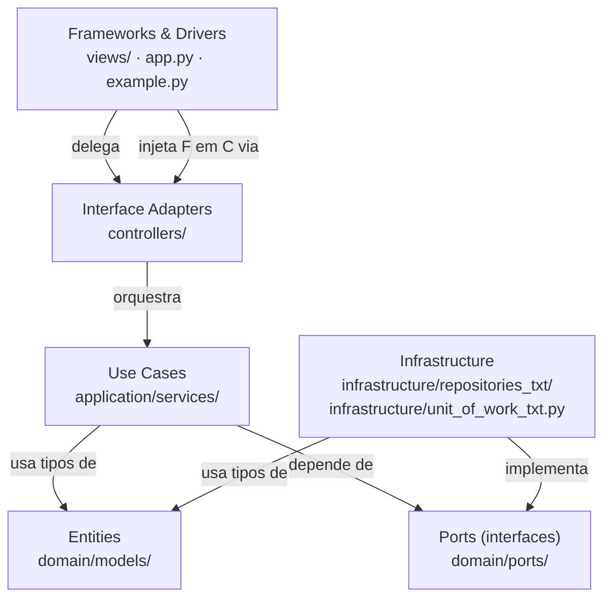
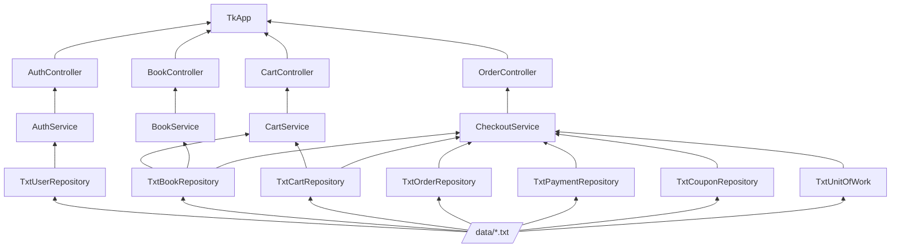
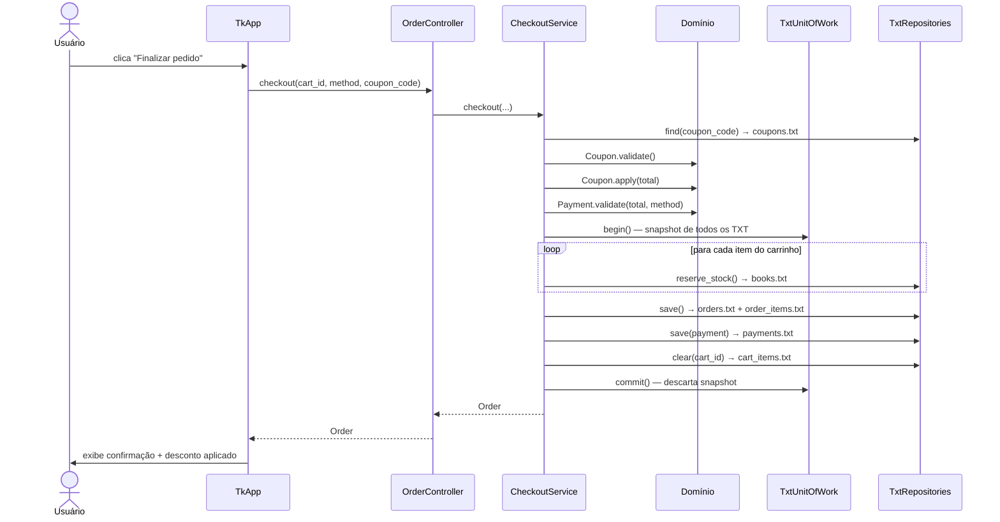

# Livraria — Lab Engenharia de Software

Sistema de livraria desenvolvido em Python puro, seguindo **Clean Architecture** com persistência em arquivos TXT (JSON Lines) e aplicação do **Princípio de Inversão de Dependência (DIP)**.

---

## Como rodar

**Pré-requisito:** Python 3.10+ (sem dependências externas — apenas biblioteca padrão)

```bash
# Demo via console — fluxo completo automatizado + seed de dados
python example.py

# Interface gráfica (Tkinter)
python app.py
```

O diretório `data/` é criado automaticamente na primeira execução com os arquivos TXT de persistência. O usuário `admin` (senha `123456`) e o cupom `DESC10` (10% de desconto) são criados automaticamente — nenhuma configuração manual é necessária.

---

## Arquitetura

O projeto segue **Clean Architecture** (arquitetura de círculos concêntricos). A regra central é a **Dependency Rule**: o código-fonte só pode apontar para dentro — camadas internas jamais conhecem camadas externas.

```
╔══════════════════════════════════════════════════════╗
║  Frameworks & Drivers  (views/, app.py, example.py) ║
║  ┌────────────────────────────────────────────────┐  ║
║  │  Interface Adapters  (controllers/)            │  ║
║  │  ┌──────────────────────────────────────────┐  │  ║
║  │  │  Use Cases  (application/services/)      │  │  ║
║  │  │  ┌────────────────────────────────────┐  │  │  ║
║  │  │  │  Entities + Ports  (domain/)       │  │  │  ║
║  │  │  └────────────────────────────────────┘  │  │  ║
║  │  └──────────────────────────────────────────┘  │  ║
║  └────────────────────────────────────────────────┘  ║
╚══════════════════════════════════════════════════════╝
        Infraestrutura (infrastructure/) implementa
        os Ports definidos no Domínio
```

### DIP — Princípio de Inversão de Dependência

Os serviços de aplicação **não importam** implementações concretas de repositórios. Eles dependem de interfaces (ports) definidas no próprio domínio:

```
TxtBookRepository  →  implementa  →  IBookRepository   (domain/ports)
BookService        →  depende de  →  IBookRepository   (domain/ports)
app.py             →  injeta TxtBookRepository onde BookService espera IBookRepository
```

O núcleo do sistema (domínio + aplicação) é completamente independente de tecnologia de persistência. Trocar TXT por banco de dados ou outro mecanismo não exige alterar nenhum service, nenhum modelo de domínio.

### Fluxo de dependências



### Responsabilidades por camada

| Camada | Localização | Responsabilidade | Proibido |
|---|---|---|---|
| **Entities** | `domain/models/` | Regras de negócio puras, validações | Qualquer import externo ao domínio |
| **Ports** | `domain/ports/` | Interfaces ABC para repositórios e UoW | Imports de infra ou aplicação |
| **Use Cases** | `application/services/` | Orquestra casos de uso usando ports | Imports de `infrastructure/` |
| **Interface Adapters** | `controllers/` | Delega chamadas da view para services | Lógica de negócio, acesso a dados |
| **Infrastructure** | `infrastructure/` | Implementa os ports com arquivos TXT | Imports de `application/` |
| **Drivers** | `views/`, `app.py` | UI Tkinter/console, composition root | (pode importar qualquer camada) |

### Composition root — `app.py`

`app.py` é o único lugar onde as implementações concretas são conhecidas. Toda a cadeia de dependências é montada aqui e injetada de baixo para cima:



---

## Persistência em TXT (JSON Lines)

Cada entidade é armazenada em um arquivo `.txt` no diretório `data/`, com um objeto JSON por linha:

| Arquivo | Conteúdo (exemplo de linha) |
|---|---|
| `data/users.txt` | `{"username": "admin", "password_hash": "8d9..."}` |
| `data/books.txt` | `{"id": "livro-001", "title": "Engenharia...", "price": 89.9, "stock": 8}` |
| `data/carts.txt` | `{"id": "uuid-do-carrinho"}` |
| `data/cart_items.txt` | `{"cart_id": "...", "book_id": "...", "title": "...", "quantity": 2, "unit_price": 89.9}` |
| `data/coupons.txt` | `{"code": "DESC10", "discount_pct": 10.0, "active": true, "single_use": false, "used": false}` |
| `data/orders.txt` | `{"id": "...", "total": 161.82, "status": "created", "coupon_code": "DESC10"}` |
| `data/order_items.txt` | `{"order_id": "...", "book_id": "...", "title": "...", "quantity": 2, "unit_price": 89.9}` |
| `data/payments.txt` | `{"order_id": "...", "amount": 161.82, "method": "pix", "status": "approved"}` |

### Atomicidade — TxtUnitOfWork

O checkout coordena 5 operações em arquivos distintos. A atomicidade é garantida por **snapshot em memória**:

```
begin()    → lê todos os TXT para memória (snapshot)
commit()   → descarta o snapshot (mudanças são definitivas)
rollback() → restaura os arquivos a partir do snapshot
```

Qualquer erro durante o checkout restaura todos os arquivos ao estado anterior — equivalente ao `BEGIN/COMMIT/ROLLBACK` de um banco relacional.

---

## Estrutura de arquivos

```
app.py                                  # Entry point — GUI Tkinter (composition root)
example.py                              # Entry point — demo CLI + seed
data/                                   # Criado automaticamente — persistência TXT
  users.txt
  books.txt
  carts.txt · cart_items.txt
  coupons.txt
  orders.txt · order_items.txt
  payments.txt
livraria/
  __init__.py
  domain/
    models/
      user.py                           # User: validate(), hash_password()
      book.py                           # Book: can_reserve()
      cart.py                           # Cart / CartItem: total, validate_add()
      order.py                          # Order / OrderItem: subtotal
      payment.py                        # Payment: validate()
      coupon.py                         # Coupon: validate(), apply()
    ports/
      repositories.py                   # IUserRepository, IBookRepository, ICartRepository,
                                        # IOrderRepository, IPaymentRepository, ICouponRepository
      unit_of_work.py                   # IUnitOfWork
  application/
    services/
      auth_service.py                   # Registro e autenticação
      book_service.py                   # Criação e listagem de livros
      cart_service.py                   # Gestão do carrinho
      checkout_service.py               # Checkout transacional + preview de desconto
  infrastructure/
    repositories_txt/
      txt_store.py                      # Helper de I/O: read_all, write_all, append
      user_repository.py                # TxtUserRepository implements IUserRepository
      book_repository.py                # TxtBookRepository implements IBookRepository
      cart_repository.py                # TxtCartRepository implements ICartRepository
      order_repository.py               # TxtOrderRepository implements IOrderRepository
      payment_repository.py             # TxtPaymentRepository implements IPaymentRepository
      coupon_repository.py              # TxtCouponRepository implements ICouponRepository
    unit_of_work_txt.py                 # TxtUnitOfWork implements IUnitOfWork
  controllers/
    auth_controller.py                  # Delega para AuthService
    book_controller.py                  # Delega para BookService
    cart_controller.py                  # Delega para CartService
    order_controller.py                 # Delega para CheckoutService
  views/
    console_view.py                     # Saída formatada no terminal
    tk_view.py                          # Interface gráfica Tkinter (TkApp)
```

---

## Fluxos principais

### Autenticação

```
View coleta usuário/senha
  → AuthController.login()
    → AuthService.authenticate()       ← depende de IUserRepository (port)
      → TxtUserRepository.find()       ← lê users.txt
      → User.hash_password()           ← lógica de domínio pura
        → retorna True/False
```

### Checkout com cupom (transação atômica)



### Preview de desconto em tempo real

```
Usuário digita no campo "Cupom" (trace no StringVar do Tkinter)
  → TkApp._on_coupon_change()
    → OrderController.preview_discount(cart_total, code)
      → CheckoutService.preview_discount()
        → TxtCouponRepository.find()    ← lê coupons.txt
        → Coupon.validate()
        → Coupon.apply(total)
          → retorna (total_descontado, economia)
View atualiza total instantaneamente (verde = válido, vermelho = inválido)
```

---

## Interface gráfica

Ao rodar `python app.py`:

| Tela | Descrição |
|---|---|
| **Login** | Entrada com usuário e senha. Link para tela de registro. |
| **Registro** | Formulário com usuário, senha e confirmação. |
| **Principal** | Lista de livros disponíveis com preço e estoque. |
| **Cadastrar livro** | Formulário inline (título, preço, estoque). |
| **Carrinho** | Itens com subtotais e total em tempo real. |
| **Checkout** | Método de pagamento (Pix/Cartão/Dinheiro) + campo de cupom com preview instantâneo do desconto. |

---

## Dados criados automaticamente

| Dado | Valor |
|---|---|
| Usuário | `admin` |
| Senha | `123456` |
| Cupom | `DESC10` — 10% de desconto — uso ilimitado |

O `example.py` também adiciona o livro "Engenharia de Software na Pratica" (R$ 89,90, estoque 10) e realiza um checkout completo com o cupom `DESC10`, resultando em total de R$ 161,82.
