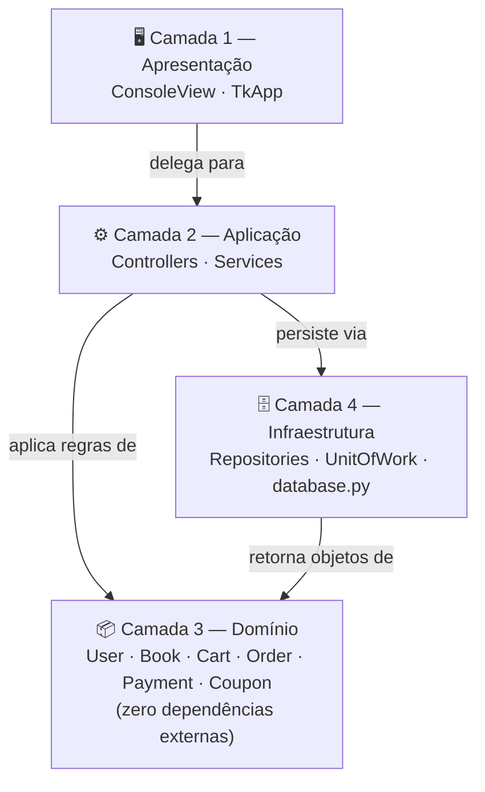
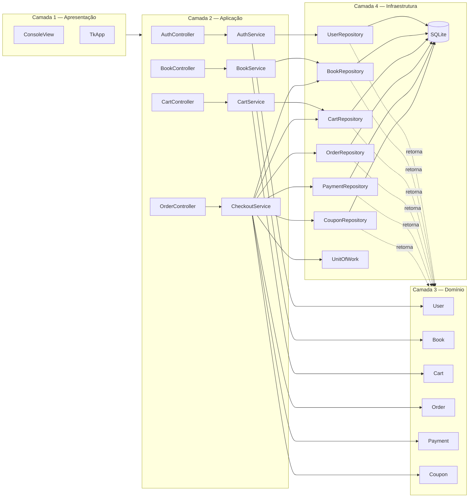
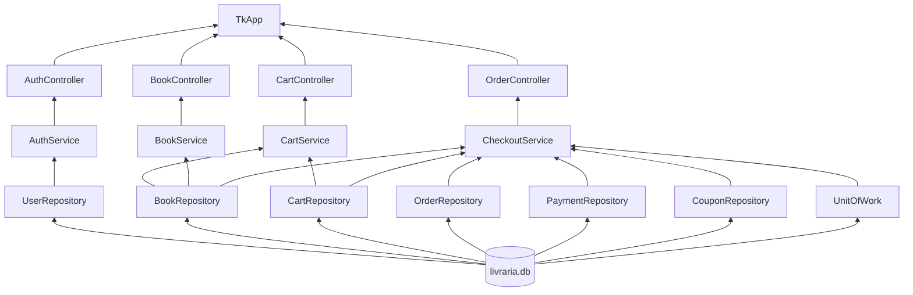
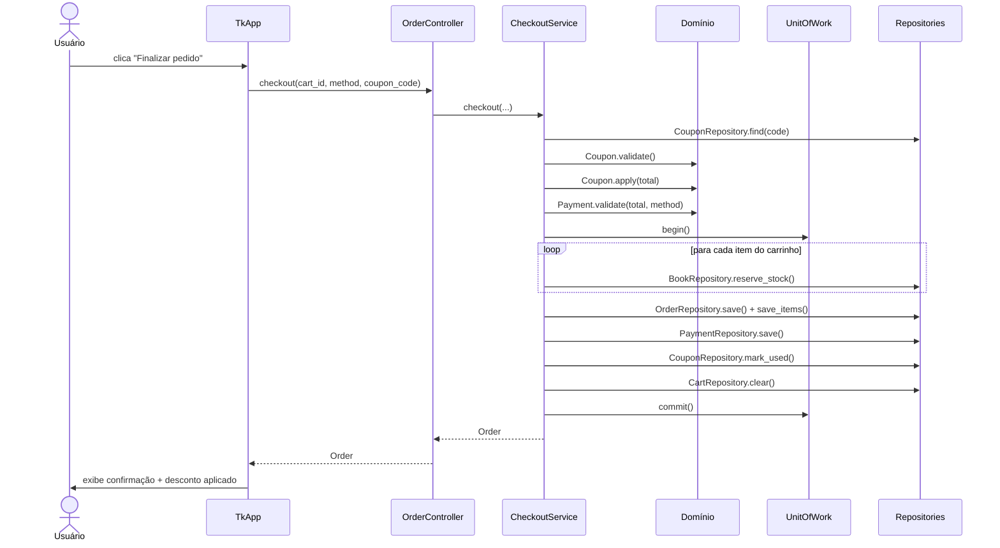

# Livraria — Lab Engenharia de Software

Sistema de livraria desenvolvido em Python com persistência SQLite, seguindo arquitetura **multicamadas (N-Tier)** com 4 camadas bem definidas.

---

## Como rodar

**Pré-requisito:** Python 3.10+ (sem dependências externas — apenas biblioteca padrão)

```bash
# Interface gráfica (Tkinter)
python app.py

# Demo via console — fluxo completo automatizado + seed de dados
python example.py
```

O arquivo `livraria.db` é criado automaticamente na raiz do projeto na primeira execução.

Na primeira vez que `app.py` é executado, o sistema cria automaticamente o usuário `admin` (senha `123456`) e o cupom `DESC10` (10% de desconto) caso ainda não existam no banco — não é necessário nenhum passo manual de configuração.

---

## Arquitetura

O projeto segue uma **arquitetura multicamadas (N-Tier) com 4 camadas**. A regra central é: **nenhuma camada importa uma camada acima dela**. O Domínio não conhece ninguém — todas as outras camadas podem depender dele, mas ele nunca depende delas.

### Dependências entre camadas



> A camada 4 (Infraestrutura) depende da camada 3 (Domínio) porque os Repositories criam e retornam objetos de domínio (`Book`, `Order`, etc.). Isso **não é violação** — a dependência vai de 4 para 3, nunca o contrário. O Domínio não importa nada de infraestrutura.

### Componentes por camada



### Responsabilidades por camada

| Camada | O que faz | O que NÃO faz |
|---|---|---|
| **Apresentação** | Renderiza UI, captura eventos | Nenhuma regra de negócio, nenhum SQL |
| **Aplicação** | Orquestra casos de uso (Services) | Não acessa banco diretamente |
| **Domínio** | Valida dados, aplica regras de negócio | Não importa `sqlite3`, não conhece repos |
| **Infraestrutura** | Todo o SQL, fábrica de conexão | Não contém lógica de negócio |

> **`UnitOfWork`:** o checkout precisa de uma transação atômica que coordena 5 repositórios (estoque, pedido, pagamento, cupom e carrinho). `infrastructure/unit_of_work.py` encapsula `BEGIN/COMMIT/ROLLBACK` sem expor `sqlite3` à camada de Aplicação — mantendo a separação de camadas íntegra.

### Composição — `app.py`

`app.py` funciona como **composition root**: monta toda a cadeia de dependências de baixo para cima e entrega os controllers prontos à View. Nenhuma camada instancia suas próprias dependências.



---

## Estrutura de arquivos

```
app.py                              # Entry point — interface gráfica (composition root)
example.py                          # Entry point — demo CLI + seed de dados iniciais
livraria/
  database.py                       # get_connection(), init_db() — schema e migração
  domain/
    models/
      user.py                       # User: validate(), hash_password()
      book.py                       # Book: can_reserve()
      cart.py                       # Cart / CartItem: total, validate_add()
      order.py                      # Order / OrderItem: subtotal
      payment.py                    # Payment: validate()
      coupon.py                     # Coupon: validate(), apply()
  infrastructure/
    unit_of_work.py                 # UnitOfWork — encapsula BEGIN/COMMIT/ROLLBACK
    repositories/
      user_repository.py            # SQL: find, exists, save
      book_repository.py            # SQL: find, all, save, reserve_stock
      cart_repository.py            # SQL: create, find, add_item, remove_item, clear
      order_repository.py           # SQL: save, save_items, all
      payment_repository.py         # SQL: save
      coupon_repository.py          # SQL: find, save, mark_used
  application/
    services/
      auth_service.py               # Registro e autenticação
      book_service.py               # Criação e listagem de livros
      cart_service.py               # Gestão do carrinho
      checkout_service.py           # Checkout transacional + preview de desconto
  controllers/
    auth_controller.py              # Delega para AuthService
    book_controller.py              # Delega para BookService
    cart_controller.py              # Delega para CartService
    order_controller.py             # Delega para CheckoutService
  views/
    console_view.py                 # Saída formatada no terminal
    tk_view.py                      # Interface gráfica Tkinter (TkApp)
```

---

## Fluxos principais

### Autenticação

```
View coleta usuário/senha
  → AuthController.login()
    → AuthService.authenticate()
      → UserRepository.find()      ← único acesso ao banco
      → User.hash_password()       ← lógica de domínio pura
        → retorna True/False
```

### Checkout com cupom (transação atômica)



### Preview de desconto em tempo real

```
Usuário digita no campo "Cupom" (trace no StringVar do Tkinter)
  → TkApp._on_coupon_change()
    → OrderController.preview_discount(cart_total, code)
      → CheckoutService.preview_discount()
        → CouponRepository.find()
        → Coupon.validate()
        → Coupon.apply(total)
          → retorna (total_descontado, economia)
View atualiza total instantaneamente (verde = válido, vermelho = inválido)
```

---

## Schema do banco de dados

```
users         (username PK, password_hash)
books         (id PK, title, price, stock CHECK >= 0)
carts         (id PK)
cart_items    (cart_id FK, book_id FK, title, quantity CHECK > 0, unit_price)
coupons       (code PK, discount_pct CHECK > 0..100, active, single_use, used)
orders        (id PK, total, status, coupon_code FK → coupons)
order_items   (order_id FK, book_id, title, quantity, unit_price)
payments      (order_id PK FK, amount, method, status)
```

Foreign keys ativas via `PRAGMA foreign_keys = ON`. Estoque protegido por `CHECK (stock >= 0)` no banco e por `WHERE stock >= quantity` no UPDATE.

---

## Interface gráfica

Ao rodar `python app.py`:

| Tela | Descrição |
|---|---|
| **Login** | Entrada com usuário e senha. Link para tela de registro. |
| **Registro** | Formulário com usuário, senha e confirmação. |
| **Principal** | Lista de livros disponíveis com preço e estoque. |
| **Cadastrar livro** | Formulário inline (título, preço, estoque). |
| **Carrinho** | Itens com subtotais e total em tempo real. |
| **Checkout** | Método de pagamento (Pix/Cartão/Dinheiro) + campo de cupom com preview instantâneo do desconto. |

---

## Dados de teste (criados automaticamente pelo `app.py`)

| Dado | Valor |
|---|---|
| Usuário | `admin` |
| Senha | `123456` |
| Livro | "Engenharia de Software na Pratica" — R$ 89,90 — estoque 10 |
| Cupom | `DESC10` — 10% de desconto — uso ilimitado |
