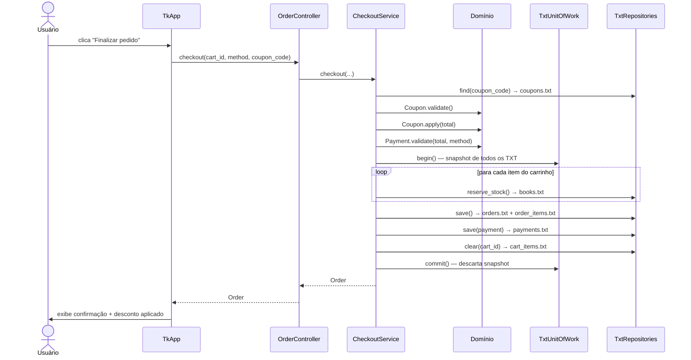

# Livraria — Lab Engenharia de Software

Sistema de livraria em Python puro, implementado com **Clean Architecture**, persistência em **arquivos TXT** (JSON Lines) e **DIP** (Princípio de Inversão de Dependência).

---

## Pré-requisito

Python 3.10 ou superior. Sem dependências externas — usa apenas a biblioteca padrão.

---

## Como rodar

```bash
python app.py
```

Isso é tudo. Na primeira execução o sistema cria o diretório `data/` com todos os arquivos de persistência e já popula os dados de teste abaixo.

---

## Credenciais e dados de teste (criados automaticamente)

| Dado | Valor |
|---|---|
| Usuário | `admin` |
| Senha | `123456` |
| Livro disponível | "Engenharia de Software na Pratica" — R$ 89,90 — estoque 10 |
| Cupom de desconto | `DESC10` — 10% de desconto — uso ilimitado |

> Para testar o desconto: adicione o livro ao carrinho, coloque o código `DESC10` no campo Cupom e clique em Finalizar. O total de 2 unidades passa de R$ 179,80 para R$ 161,82.

---

## Interface gráfica

| Tela | O que faz |
|---|---|
| **Login** | Entrada com usuário e senha. Link para criar conta. |
| **Registro** | Cadastra novo usuário com confirmação de senha. |
| **Principal** | Lista livros com preço e estoque em tempo real. |
| **Cadastrar livro** | Formulário inline para adicionar novos livros. |
| **Carrinho** | Itens com subtotais; botão para remover item. |
| **Checkout** | Escolha de pagamento (Pix / Cartão / Dinheiro) + campo de cupom com preview instantâneo do desconto (verde = válido, vermelho = inválido). |

---

## Demo via console

```bash
python example.py
```

Executa o fluxo completo no terminal: login → criar livro → adicionar ao carrinho → checkout com cupom → exibe pedido e estoque restante.

---

## Arquitetura

O projeto segue **Clean Architecture** (círculos concêntricos de Uncle Bob). A regra central é a **Dependency Rule**: dependências sempre apontam para dentro — camadas internas nunca conhecem as externas.

```
╔══════════════════════════════════════════════════════╗
║  Frameworks & Drivers  (views/, app.py, example.py) ║
║  ┌────────────────────────────────────────────────┐  ║
║  │  Interface Adapters  (controllers/)            │  ║
║  │  ┌──────────────────────────────────────────┐  │  ║
║  │  │  Use Cases  (application/services/)      │  │  ║
║  │  │  ┌────────────────────────────────────┐  │  │  ║
║  │  │  │  Entities + Ports  (domain/)       │  │  │  ║
║  │  │  └────────────────────────────────────┘  │  │  ║
║  │  └──────────────────────────────────────────┘  │  ║
║  └────────────────────────────────────────────────┘  ║
╚══════════════════════════════════════════════════════╝
        infrastructure/ implementa os Ports do domínio
```

### DIP — Princípio de Inversão de Dependência

Os serviços de aplicação não importam implementações concretas. Eles dependem de interfaces (ports) definidas dentro do próprio domínio:

```
TxtBookRepository  →  implementa  →  IBookRepository   (domain/ports)
BookService        →  depende de  →  IBookRepository   (domain/ports)
app.py             →  injeta TxtBookRepository onde BookService espera IBookRepository
```

O núcleo (domínio + serviços) é independente de tecnologia de persistência. Trocar TXT por banco de dados não exige alterar nenhum modelo nem nenhum service — só a infraestrutura e o composition root.

### Responsabilidades por camada

| Camada | Onde fica | O que faz | Proibido |
|---|---|---|---|
| **Entities** | `domain/models/` | Regras de negócio, validações | Qualquer import fora do domínio |
| **Ports** | `domain/ports/` | Interfaces ABC para repositórios e UoW | Imports de infra ou aplicação |
| **Use Cases** | `application/services/` | Orquestra casos de uso via ports | Imports de `infrastructure/` |
| **Interface Adapters** | `controllers/` | Delega view → service, service → view | Lógica de negócio, acesso a dados |
| **Infrastructure** | `infrastructure/` | Implementa os ports (lê/escreve TXT) | Imports de `application/` |
| **Frameworks & Drivers** | `views/`, `app.py` | UI Tkinter/console, composition root | — |

### Composition root — `app.py`

`app.py` é o único arquivo que conhece todas as implementações concretas. Ele monta a cadeia de dependências de baixo para cima e injeta tudo na view:

```
data/*.txt
  → TxtXxxRepository  (implementa IXxxRepository)
  → XxxService        (recebe IXxxRepository)
  → XxxController     (recebe XxxService)
  → TkApp             (recebe os controllers)
```

---

## Persistência em TXT (JSON Lines)

Cada entidade é armazenada em um arquivo `.txt` dentro de `data/`. Cada linha é um objeto JSON independente:

| Arquivo | Exemplo de linha |
|---|---|
| `users.txt` | `{"username": "admin", "password_hash": "8d969..."}` |
| `books.txt` | `{"id": "livro-001", "title": "Engenharia...", "price": 89.9, "stock": 10}` |
| `carts.txt` | `{"id": "uuid-do-carrinho"}` |
| `cart_items.txt` | `{"cart_id": "...", "book_id": "...", "title": "...", "quantity": 2, "unit_price": 89.9}` |
| `coupons.txt` | `{"code": "DESC10", "discount_pct": 10.0, "active": true, "single_use": false, "used": false}` |
| `orders.txt` | `{"id": "...", "total": 161.82, "status": "created", "coupon_code": "DESC10"}` |
| `order_items.txt` | `{"order_id": "...", "book_id": "...", "title": "...", "quantity": 2, "unit_price": 89.9}` |
| `payments.txt` | `{"order_id": "...", "amount": 161.82, "method": "pix", "status": "approved"}` |

### Atomicidade — TxtUnitOfWork

O checkout coordena 5 operações em arquivos distintos. A atomicidade é garantida por snapshot em memória:

```
begin()    → salva o conteúdo atual de todos os TXT em memória
commit()   → descarta o snapshot (mudanças tornam-se definitivas)
rollback() → restaura todos os arquivos a partir do snapshot salvo
```

Se qualquer passo falhar, todos os arquivos voltam ao estado anterior ao checkout — equivalente a um `BEGIN / COMMIT / ROLLBACK` de banco relacional.

---

## Estrutura de arquivos

```
app.py                                  # Entry point — GUI Tkinter (composition root)
example.py                              # Entry point — demo CLI + seed
data/                                   # Criado automaticamente na 1ª execução
  users.txt · books.txt · carts.txt
  cart_items.txt · coupons.txt
  orders.txt · order_items.txt · payments.txt
livraria/
  domain/
    models/
      user.py                           # User: validate(), hash_password()
      book.py                           # Book: can_reserve()
      cart.py                           # Cart / CartItem: total, validate_add()
      order.py                          # Order / OrderItem: subtotal
      payment.py                        # Payment: validate()
      coupon.py                         # Coupon: validate(), apply()
    ports/
      repositories.py                   # IUserRepository, IBookRepository, ICartRepository,
                                        # IOrderRepository, IPaymentRepository, ICouponRepository
      unit_of_work.py                   # IUnitOfWork
  application/
    services/
      auth_service.py                   # Registro e autenticação
      book_service.py                   # Criação e listagem de livros
      cart_service.py                   # Gestão do carrinho
      checkout_service.py               # Checkout transacional + preview de desconto
  infrastructure/
    repositories_txt/
      txt_store.py                      # Helper de I/O: read_all, write_all, append
      user_repository.py                # TxtUserRepository  implements IUserRepository
      book_repository.py                # TxtBookRepository  implements IBookRepository
      cart_repository.py                # TxtCartRepository  implements ICartRepository
      order_repository.py               # TxtOrderRepository implements IOrderRepository
      payment_repository.py             # TxtPaymentRepository implements IPaymentRepository
      coupon_repository.py              # TxtCouponRepository implements ICouponRepository
    unit_of_work_txt.py                 # TxtUnitOfWork implements IUnitOfWork
  controllers/
    auth_controller.py                  # Delega para AuthService
    book_controller.py                  # Delega para BookService
    cart_controller.py                  # Delega para CartService
    order_controller.py                 # Delega para CheckoutService
  views/
    console_view.py                     # Saída formatada no terminal
    tk_view.py                          # Interface gráfica Tkinter (TkApp)
```

---

## Fluxos principais

### Autenticação

```
View coleta usuário/senha
  → AuthController.login()
    → AuthService.authenticate()       ← depende de IUserRepository (port)
      → TxtUserRepository.find()       ← lê users.txt
      → User.hash_password()           ← lógica de domínio pura
        → retorna True/False
```

### Checkout com cupom (transação atômica)



### Preview de desconto em tempo real

```
Usuário digita no campo "Cupom" (trace no StringVar do Tkinter)
  → TkApp._on_coupon_change()
    → OrderController.preview_discount(cart_total, code)
      → CheckoutService.preview_discount()
        → TxtCouponRepository.find()    ← lê coupons.txt
        → Coupon.validate()
        → Coupon.apply(total)
          → retorna (total_descontado, economia)
View atualiza total instantaneamente (verde = válido, vermelho = inválido)
```
